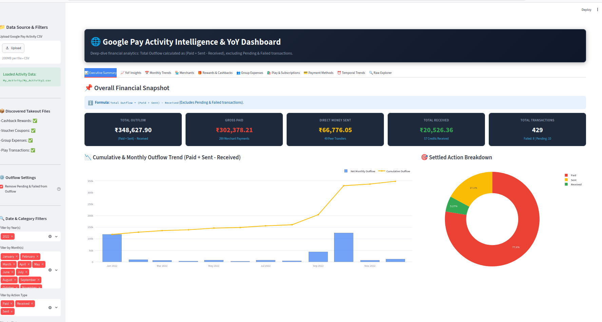
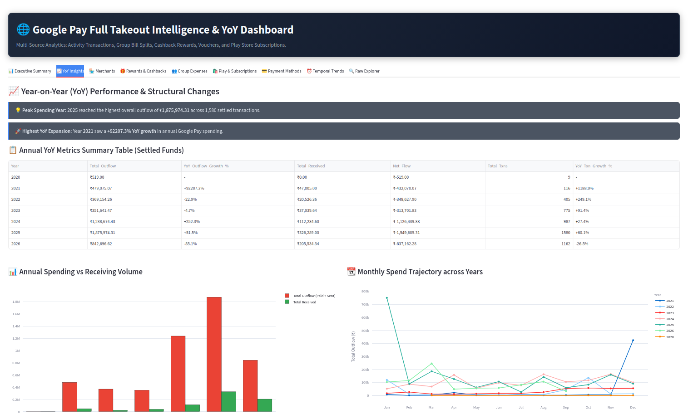
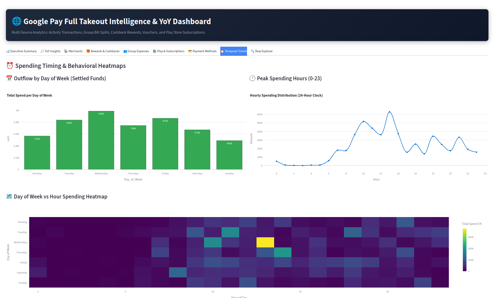

# 💳 Google Pay Takeout Analytics & Converter

[](https://www.python.org/)
[](https://streamlit.io/)
[](LICENSE)

An interactive, locally-hosted **Google Pay Analytics Dashboard** and HTML-to-CSV parser. Analyze your personal spending patterns, transaction histories, rewards, group bill splits, and payment statistics from your official **Google Takeout** export without compromising your data privacy.

> [!IMPORTANT]
> **Data Privacy & Security First**: This repository contains **NO private personal data**. All scripts process your Google Takeout data strictly on your local machine. No financial information or transaction records are ever sent to external servers or stored in this repository.

---

## 📸 Dashboard Preview

| **Dashboard Overview & Executive KPIs** | **Spending Analytics & YoY Trends** |
| :---: | :---: |
|  |  |

| **Transaction Insights & Merchant Intelligence** |
| :---: |
|  |

---

## ✨ Features

- 🧹 **HTML Activity Parser (`convert_activity_to_csv.py`)**:
  - Parses raw `My_Activity.html` files exported from Google Takeout.
  - Extracts Transaction IDs, Statuses (Completed, Pending, Failed), Amounts, Currencies, Recipients/Merchants, Payment Methods, and Timestamps into clean, structured CSV format.

- 📊 **Interactive Streamlit Dashboard (`app.py`)**:
  - **Executive Summary & Scorecards**: Instant summaries of Total Outflow `((Paid + Sent) - Received)`, Gross Paid, Direct Sent, Total Received, and Transaction Counts.
  - **Year-on-Year (YoY) & Monthly Trends**: Detailed YoY and Month-on-Month (MoM) growth metrics, monthly spend trajectories, and calendar month seasonality analysis.
  - **Merchant & Payee Intelligence**: Top merchants by spend and transaction frequency, plus single-merchant deep dives.
  - **Rewards & Cashback Analytics**: Tracks cashback earned and scratch card vouchers/coupons.
  - **Group Expenses & Bill Splits**: Detailed analysis of shared trip expenses and individual settlement status.
  - **Google Play & Subscriptions**: Track digital purchases and app subscriptions.
  - **Outflow Formula Control**: Option to strictly exclude Pending and Failed transactions from Outflow totals.
  - **Date & Category Filters**: Dynamic Year(s), Month(s), Action Type, and Status selectors.

---

## 📁 Repository Structure

```text
Google-Pay-Takeout-Analytics/
├── assets/                       # Dashboard screenshots
│   ├── Dashboard_overview.png
│   ├── spending_analytics.png
│   └── transaction_insights.png
├── app.py                        # Multi-source Streamlit dashboard application
├── convert_activity_to_csv.py    # Takeout HTML activity to structured CSV converter
├── requirements.txt              # Python dependency file
├── .gitignore                    # Prevents private Google Takeout data from being committed
└── README.md                     # Project documentation
```

---

## 🔒 Security & `.gitignore` Safeguards

To prevent personal financial data from being pushed to GitHub, a pre-configured `.gitignore` file is included in this repository. It automatically blocks:
- `My_Activity.html` and any `*.html` files
- `*.csv`, `*.json`, and `*.xlsx` files
- Google Takeout extracted data directories (`Google transactions/`, `Group expenses/`, `My_Activity/`, `Rewards earned/`)
- Python cache files and virtual environments (`venv/`)

---

## 🚀 Getting Started

### 1. Prerequisites

Ensure you have Python 3.8 or higher installed on your system.

### 2. Clone the Repository

```bash
git clone https://github.com/YOUR-USERNAME/Google-Pay-Takeout-Analytics.git
cd Google-Pay-Takeout-Analytics
```

### 3. Install Dependencies

```bash
pip install -r requirements.txt
```

### 4. Convert Activity HTML to CSV

```bash
python3 convert_activity_to_csv.py "My_Activity/My_Activity.html" "My_Activity/My_Activity.csv"
```

### 5. Launch Dashboard

```bash
streamlit run app.py
```

---

## 📄 License

This project is licensed under the MIT License - see the [LICENSE](LICENSE) file for details.
