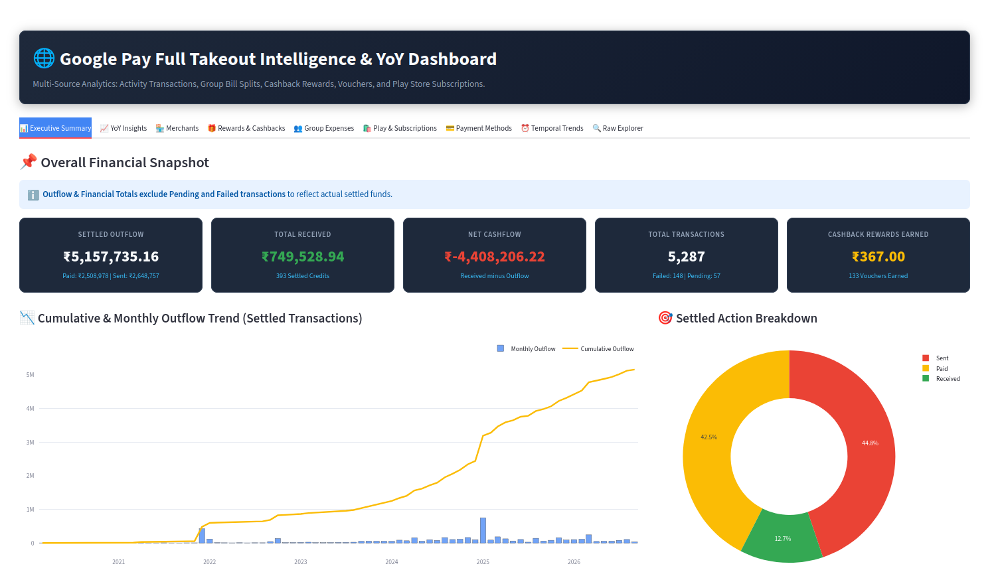

# 💳 Google Pay Takeout Analytics & Converter

[](https://www.python.org/)
[](https://streamlit.io/)
[](LICENSE)

An interactive, locally-hosted **Google Pay Analytics Dashboard** and HTML-to-CSV parser. Analyze your personal spending patterns, transaction histories, rewards, and payment statistics from your official **Google Takeout** export without compromising your data privacy.

> [!IMPORTANT]
> **Data Privacy & Security First**: This repository contains **NO private personal data**. All scripts process your Google Takeout data strictly on your local machine. No financial information or transaction records are ever sent to external servers or stored in this repository.

---

## 📸 Dashboard Preview

*(Replace the placeholder images below with screenshots of your dashboard in the `assets/` directory)*

| **Overview & KPI Metrics** | **Monthly Spending Trends** |
| :---: | :---: |
|  |  |

| **Category Breakdown** | **Recipient & Transaction Insights** |
| :---: | :---: |
|  |  |

---

## ✨ Features

- 🧹 **HTML Activity Parser (`convert_activity_to_csv.py`)**:
  - Parses raw `My_Activity.html` files exported from Google Takeout.
  - Extracts Transaction IDs, Statuses (Completed, Pending, Failed), Amounts, Currencies, Recipients/Merchants, Payment Methods, and Timestamps into clean, structured CSV format.

- 📊 **Interactive Streamlit Dashboard (`app.py`)**:
  - **KPI Scorecards**: Instant summaries of Total Spending, Transaction Counts, Success Rates, and Average Transaction Values.
  - **Time Series & Trend Analysis**: Monthly and weekly expenditure breakdowns using interactive Plotly charts.
  - **Merchant & Recipient Insights**: Analyze top vendors, frequent recipients, and peer-to-peer transfers.
  - **Status Filtering**: Filter by successful, failed, or pending payments to audit failed transactions easily.
  - **Date & Category Filters**: Dynamic date range selector and search capability.

---

## 📁 Repository Structure

```text
Google-Pay-Takeout-Analytics/
├── assets/                       # Place screenshots of your dashboard here
│   ├── dashboard_overview.png
│   ├── spending_analytics.png
│   ├── category_breakdown.png
│   └── transaction_insights.png
├── app.py                        # Streamlit dashboard application
├── convert_activity_to_csv.py    # Takeout HTML activity to structured CSV converter
├── requirements.txt              # Python dependency file
├── .gitignore                    # Prevents private Google Takeout data from being committed
└── README.md                     # Project documentation
```

---

## 🔒 Security & `.gitignore` Safeguards

To prevent personal financial data from being pushed to GitHub, a pre-configured `.gitignore` file is included in this repository. It automatically blocks:
- `My_Activity.html` and any `*.html` files
- `*.csv`, `*.json`, and `*.xlsx` files
- Google Takeout extracted data directories (`Google transactions/`, `My_Activity/`, etc.)
- Python cache files and virtual environments (`venv/`)

---

## 🚀 Getting Started

### 1. Prerequisites

Ensure you have Python 3.8 or higher installed on your system.

### 2. Clone the Repository

```bash
git clone https://github.com/YOUR-USERNAME/Google-Pay-Takeout-Analytics.git
cd Google-Pay-Takeout-Analytics
```

### 3. Install Dependencies

It is recommended to use a virtual environment:

```bash
# Create virtual environment
python -m venv venv

# Activate on Linux/macOS:
source venv/bin/activate

# Activate on Windows:
# venv\Scripts\activate

# Install required packages
pip install -r requirements.txt
```

---

## 📥 How to Export Your Google Pay Data

1. Visit [Google Takeout](https://takeout.google.com/).
2. Click **Deselect all** and scroll down to select **Google Pay**.
3. Choose `.zip` format and request the export.
4. Download and extract the zip archive once ready.
5. Locate your `My_Activity.html` file (usually inside `Takeout/Google Pay/My_Activity/`).

---

## 🛠️ Usage Instructions

### Step 1: Convert HTML Activity to CSV (Optional)

If your Takeout export is in HTML format, run the conversion script to parse your data into a structured CSV file:

```bash
python convert_activity_to_csv.py
```

### Step 2: Run the Streamlit Dashboard

Launch the interactive dashboard in your browser:

```bash
streamlit run app.py
```

Once launched, open your web browser at `http://localhost:8501`.

---

## 🤝 Contributing

Contributions, issues, and feature requests are welcome! Feel free to check out the issues page if you want to contribute.

---

## 📄 License

Distributed under the MIT License. See `LICENSE` for more details.
